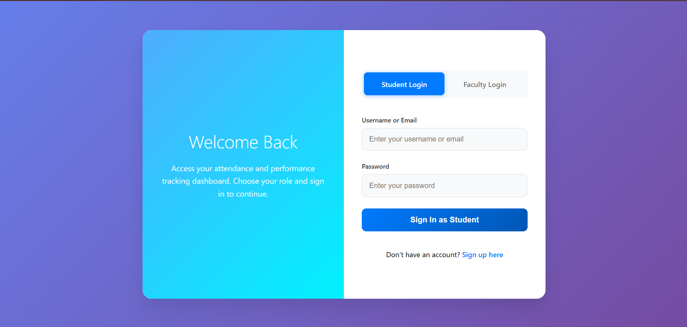
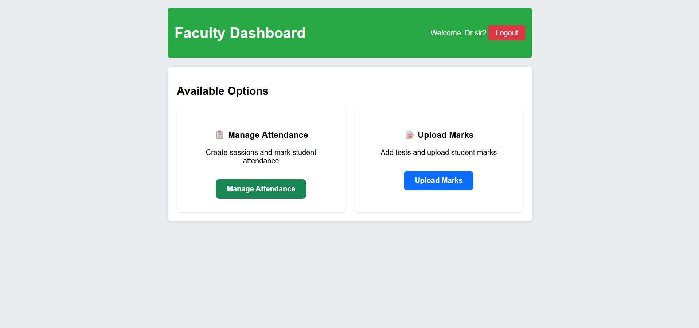
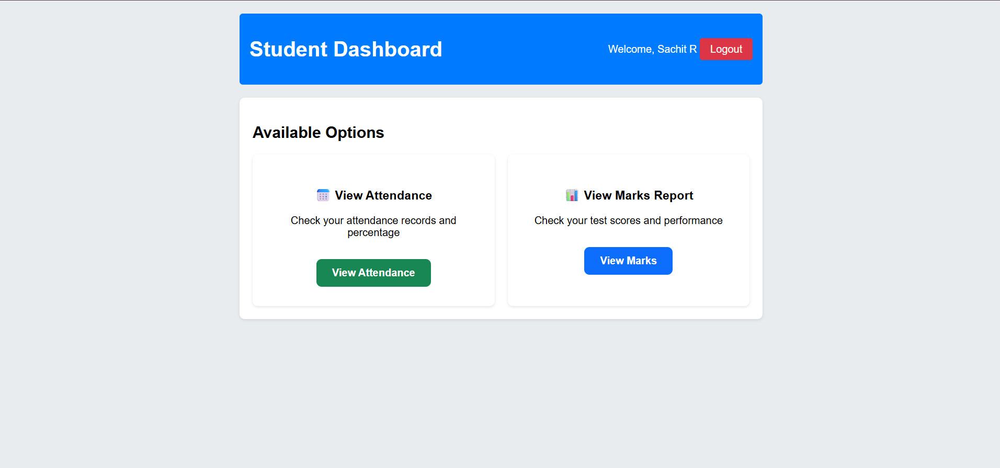

# Student Attendance and Performance Tracker

A comprehensive web application for managing student attendance and academic performance with role-based access control.

## 🚀 Features

## 📸 Screenshots

### Login Page


### Faculty Dashboard


### Student Dashboard


### For Faculty
- **Attendance Management**: Create sessions, mark attendance, view reports
- **Performance Tracking**: Create tests, upload marks, calculate percentages
- **Dashboard**: Unified interface for all management tasks

### For Students  
- **Attendance View**: Check attendance records and statistics
- **Performance View**: View test scores and performance metrics
- **Dashboard**: Personal overview of academic progress

## 🛠️ Technology Stack

- **Backend**: Spring Boot 3.x, Spring Data JPA, Hibernate
- **Frontend**: Thymeleaf, HTML5, CSS3, JavaScript
- **Database**: MySQL 8.0
- **Authentication**: Session-based with role management

## 📋 Prerequisites

- Java 17 or higher
- MySQL 8.0
- Maven 3.6+

## 🔧 Setup Instructions

1. **Clone the repository**
   ```bash
   git clone https://github.com/Sachit-281206/attendance-performance-tracker.git
   cd AttendancePerformanceTracker
   ```

2. **Configure Database**
   - Create MySQL database: `attendance_tracker`
   - Update `application.properties` with your database credentials

3. **Run the application**
   ```bash
   cd attendance_performance_tracker
   mvn spring-boot:run
   ```

4. **Access the application**
   - Open browser: `http://localhost:8081`
   - Create accounts via signup page

## 🎯 Usage

1. **Sign Up**: Create faculty or student accounts
2. **Login**: Use role-based login tabs
3. **Faculty**: Manage attendance sessions and upload marks
4. **Students**: View attendance and performance records

## 📁 Project Structure

```
attendance_performance_tracker/
├── src/main/java/com/example/attendance_performance_tracker/
│   ├── controller/     # REST controllers
│   ├── entity/         # JPA entities
│   ├── repository/     # Data repositories
│   └── service/        # Business logic
├── src/main/resources/
│   ├── templates/      # Thymeleaf templates
│   └── application.properties
└── pom.xml
```

## 🔐 Default Configuration

- **Port**: 8081
- **Database**: attendance_tracker
- **Authentication**: Session-based

## 📝 License

This project is for educational purposes.